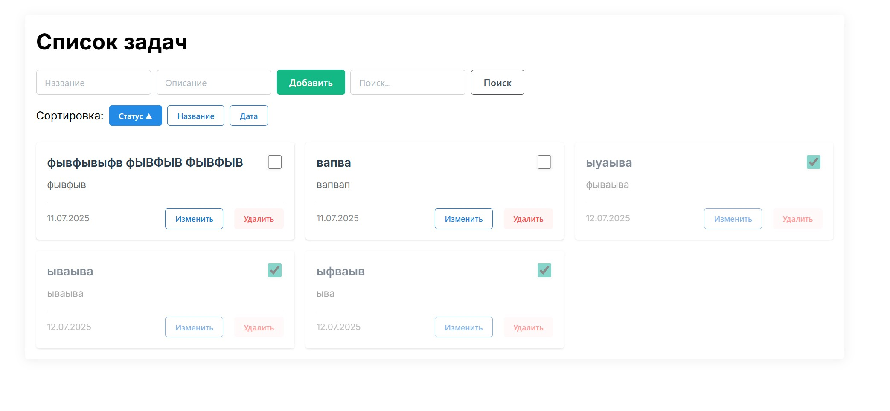

# SvelteKit ToDo: Список задач

## Кратко о процессе работы с ИИ

1. ИИ автоматически определил и установил необходимые версии Node.js и npm для поддержки SvelteKit.
2. Проект SvelteKit был инициализирован с TypeScript и минимальным шаблоном.
3. Интерфейс и логика приложения реализованы с помощью SvelteKit и IndexDB для локального хранения.
4. Все действия (создание, обновление, удаление задач) реализованы через отдельный модуль работы с IndexDB.
5. Современный карточный дизайн с адаптивностью и интуитивным интерфейсом.
6. Инструкции и документация сгенерированы автоматически.

## Основные функции приложения
- Добавление задачи (название, описание, статус)
- Просмотр всех задач в современном карточном дизайне
- Поиск задач по названию и описанию
- Сортировка по статусу, названию и дате создания
- Смена статуса задачи через чекбокс (активная/завершена)
- Редактирование названия и описания задачи
- Удаление задачи
- Локальное хранение задач в браузере (IndexDB)
- Адаптивный дизайн для мобильных и десктопных устройств

## Особенности дизайна
- Современный карточный интерфейс вместо табличного вида
- Адаптивная сетка карточек (автоматическое размещение)
- Hover-эффекты и плавные анимации
- Визуальное затемнение завершённых задач
- Стилизованные чекбоксы для смены статуса
- Панель сортировки с интуитивными кнопками
- Полностью адаптивный дизайн (мобильный < 768px, десктоп > 768px)

## Инструкция по запуску
1. Убедитесь, что установлен Node.js 20+ и npm 9+ (или выше).
2. Установите зависимости:
   ```bash
   npm install
   ```
3. Запустите приложение:
   ```bash
   npm run dev -- --open
   ```
4. Откроется браузер с интерфейсом списка задач.

## Скриншот интерфейса



---

## Краткая документация: основные промпты к ИИ

1. **Создать веб-приложение Список задач на SvelteKit с TypeScript и IndexDB**
2. **Проверь наличие установленных версий node и переключись на более новую версию 16 или выше (лучше 18+)**
3. **Обновить Node.js до версии 20 или выше**
4. **Продолжи настройку и реализацию приложения "Список задач"**
5. **Добавь функции в приложение: поиск, редактирование, сортировка**
6. **Займемся внешним видом приложения - установи Tailwind CSS или Svelte UI**
7. **Добавь адаптивность и сделай приложение более современным внешне**
8. **Создай README.md с описанием, инструкциями и документацией**

---

## Время, затраченное на этапы

| Этап                                      | Время (мин) |
|--------------------------------------------|-------------|
| Анализ требований и подготовка среды       | 5           |
| Инициализация и настройка проекта          | 5           |
| Реализация интерфейса и логики задач       | 10          |
| Интеграция IndexDB и тестирование          | 10          |
| Добавление функций поиска и сортировки     | 15          |
| Интеграция Svelte UI и стилизация          | 20          |
| Создание адаптивного карточного дизайна    | 25          |
| Документация и финальная проверка          | 10          |
| **Итого**                                 | **100**     |

## Технический стек
- **Frontend**: SvelteKit 1.x, TypeScript
- **UI Framework**: Svelte UI (@svelteuidev/core)
- **Хранение данных**: IndexDB (локальное хранение в браузере)
- **Стилизация**: CSS Grid, Flexbox, адаптивные медиазапросы
- **Node.js**: версия 20+ для совместимости с современными инструментами

## Структура проекта
```
todo-sveltekit/
├── src/
│   ├── lib/
│   │   └── todo-db.ts          # Модуль работы с IndexDB
│   └── routes/
│       └── +page.svelte        # Главная страница приложения
├── package.json
└── README.md
```
